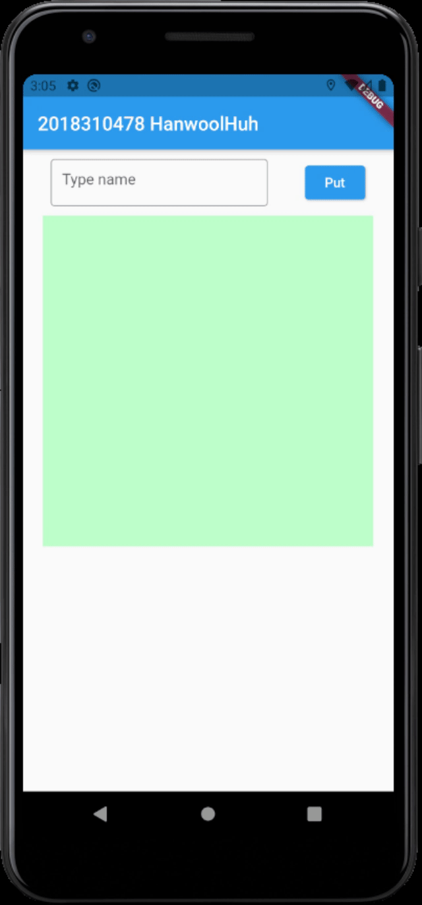

# SKKU_Mobile_App_Programming

## Get Movie Data

    This is movie searching application using omdb API.
    It prints information of input movie.

## Sliding Puzzle

## Nonogram

## Container

## Gridview

    When you click the button n times, the aplication displays n2 photo objects.
    It fetch a large JSON document from https://jsonplaceholder.typicode.com/photos.

## Covid19

    It display total vaccinated people and each country's infomation.
    It fetch a JSON document from https://covid.ourworldindata.org/data/owid-covid-data.json
    and http://raw.githubusercontent.com/owid/covid-19-data/master/public/data/vaccinations/vaccinations.json
    
>   [Things to improve]  
>   I have not yet completely filled in the graph and table information.  
>   There is a need to improve the speed of getching data.  